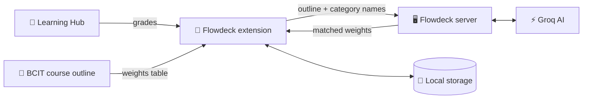
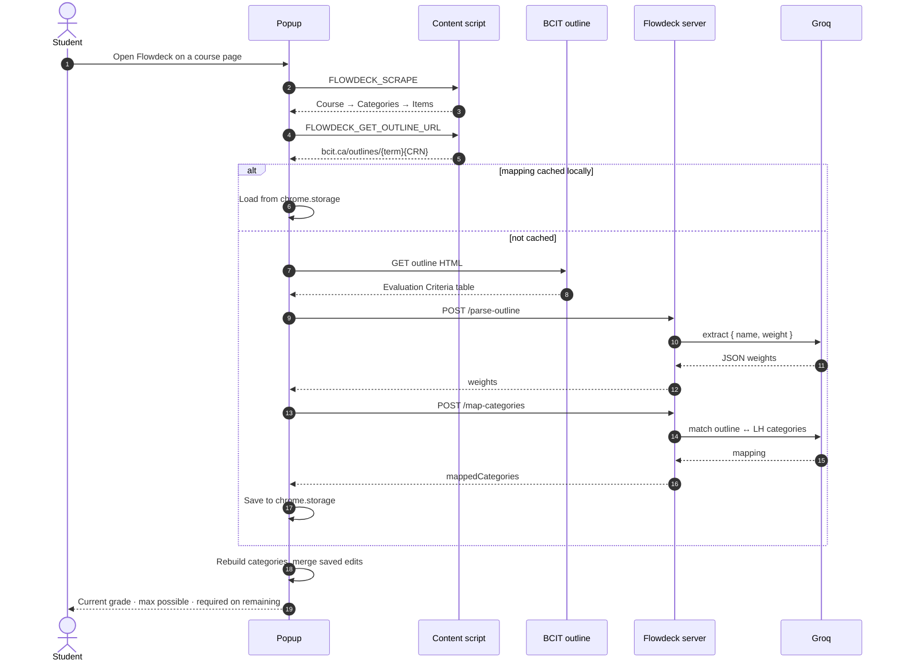

<p align="center">
  
</p>

<h1 align="center">Flowdeck</h1>

<p align="center">
  <strong>Know your grade and what you need to hit your target, right inside BCIT Learning Hub.</strong>
</p>

<p align="center">
  
  
  
  
</p>

---

Flowdeck is a Chrome extension for BCIT students. Open it on a Learning Hub (D2L Brightspace) course page and it reads your grades, gets the official grade weights from the BCIT course outline, and uses AI to match the two. You get your current grade and the score you need on the remaining work, without building a spreadsheet.

## ✨ Features

### 🔍 Course detection
- Detects the current course from the Learning Hub navigation bar. You don't pick anything.
- Builds the matching **BCIT course outline URL** from the page's context (term + CRN).

### 📥 Grade scraping
- Reads the Learning Hub grades page into a structured **Course → Category → Item** model.
- Captures each item's grade, weight and completion status.

### 🤖 AI weight matching
- **Outline parsing:** the *Evaluation Criteria* table from the course outline goes to an LLM, which returns clean `{ name, weight }` pairs.
- **Category mapping:** a second AI pass matches the outline categories (e.g. *"Labs 20%"*) to the category names your instructor used on Learning Hub (e.g. *"Lab Submissions"*, *"Lab Quizzes"*).
- Powered by `openai/gpt-oss-120b` on **Groq**, so responses come back quickly.

### ⚡ Two-layer caching
- **Client cache** (`chrome.storage.local`): the AI mapping for each outline is stored per term + CRN, so reopening a course is instant.
- **Server cache**: an in-memory cache on the server lets classmates in the same section reuse one AI result.

### ✏️ Full manual control
- Edit category weights, per-item weights and grades, and mark items as done or not done.
- Set a **manual category grade** to override the computed value.
- Press **Save** and your changes are stored locally. They're re-applied on top of fresh AI data the next time you open the course.

### 🎯 Grade calculator
| Metric | What it tells you |
|---|---|
| **Current Grade** | Your weighted grade based on completed work |
| **If Perfect on Completed** | The grade you'd have if you'd scored 100% on everything done so far |
| **Target Grade → Required** | The average you need on the remaining work to reach your target, with a per-item breakdown |

Category grades use a **weighted average** when every completed item has a weight, and fall back to a simple average when some don't.

### 🛟 Error handling
- If the outline can't be found automatically, enter the **CRN** or paste the **full outline URL**.
- If an AI request fails, a **Retry** button appears, and you can keep using the extension in the meantime.
- A warning appears when the weights shown did *not* come from the official outline.

### 🔒 Privacy
- Your grades stay in your browser (`chrome.storage.local`).
- The server receives only the outline's evaluation table and your category and item **names**. It never sees your scores or identity. See [`privacy.html`](privacy.html).

---

## 🏗️ Architecture



1. The extension reads your grades from the **Learning Hub** page.
2. It fetches the grade weights from the **BCIT course outline**.
3. The **server** asks the **AI** to match the outline's categories to the Learning Hub ones.
4. The extension calculates your grades and saves everything in **local storage**.

### Request flow



---

## 📁 Project structure

```
Flowdeck---extension/
├── flowdeck-client/          # Chrome extension (Manifest V3)
│   ├── manifest.json
│   ├── popup.html / .css     # Popup UI
│   ├── popup.js              # UI controller: scrape → outline → AI → render
│   ├── content_entry.js      # Content script: message bridge on learn.bcit.ca
│   ├── scrapedata.js         # Parses the grades DOM into a Course model
│   ├── models.js             # Course / Category / Item classes (+ JSON round-trip)
│   ├── calc.js               # Grade math: current, max-possible, required-on-remaining
│   ├── storage.js            # chrome.storage.local wrapper + outline cache
│   ├── background.js         # Service worker
│   └── icons/
├── flowdeck-server/          # Node/Express AI backend
│   └── server.js             # /parse-outline and /map-categories (Groq)
└── privacy.html              # Privacy policy
```

---

## 🚀 Getting started

### 1. Run the server (optional for local development)

```bash
cd flowdeck-server
npm install
echo "GROQ_API_KEY=your_key_here" > .env   # get a key at console.groq.com
npm start                                   # → http://localhost:3000
```

| Env var | Description | Default |
|---|---|---|
| `GROQ_API_KEY` | Groq API key used for both AI endpoints | — |
| `PORT` | Port the server listens on | `3000` |

> The extension points to the hosted server by default. To use your local server instead, change the `fetch` URLs in `flowdeck-client/popup.js` to `http://localhost:3000/...` and add that origin to `host_permissions` in `manifest.json`.

### 2. Load the extension

1. Open `chrome://extensions`
2. Turn on **Developer mode** (top right)
3. Click **Load unpacked** and select the `flowdeck-client/` folder
4. Pin Flowdeck to your toolbar

### 3. Use it

1. Log in to [learn.bcit.ca](https://learn.bcit.ca) and open a course's **Grades** page
2. Click the Flowdeck icon
3. Check the weights, adjust anything you need, and press **Save Weights**
4. Enter a **target grade** to see what you need on the remaining work

---

## 🧮 How grades are calculated

```
category_grade  = Σ(item.grade × item.weight) / Σ(item.weight)      # completed items only
                  (simple average if any completed item has no weight)

current_grade   = Σ(category_grade / 100 × category.weight)

required        = (target − current_grade) / remaining_weight × 100
```

Items with a weight of exactly `0` are ignored. A category with a manual grade always counts toward its full weight.

---

## 🛠️ Tech stack

- **Extension:** vanilla JavaScript (ES modules), Chrome Manifest V3, `chrome.storage`
- **Server:** Node.js, Express 5, CORS, dotenv
- **AI:** Groq SDK, `openai/gpt-oss-120b`

---

<p align="center">Made for BCIT students who want to know where their grades stand 🎓</p>
